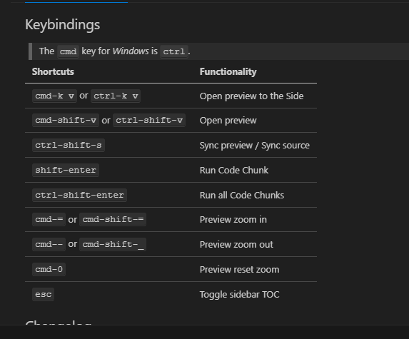

# Шаблон каталога курса для студентов

## Скачать репозиторий

git clone --recursive https://github.com/yamadharma/course-directory-student-template.git

# Основные идеи

-   Стандартные соглашения об именах
-   Стандартное соглашение для путей к файлам
-   Стандартная настройка курса внутри шаблона курса

# Общие правила

-   Рабочее пространство по предмету располагается в следующей иерархии:

    ``` bash
    ~/work/study/
    └── <учебный год>/
        └── <название предмета>/
            └── <код предмета>/
    ```

-   Например, для 2023--2024 учебного года и предмета «Операционные системы» (код предмета `os-intro`) структура каталогов примет следующий вид:

    ``` bash
    ~/work/study/
    └── 2023-2024/
        └── Операционные системы/
            └── os-intro/
    ```

-   Название проекта на хостинге git имеет вид:

    ``` example
    study_<учебный год>_<код предмета>
    ```

-   Например, для 2023--2024 учебного года и предмета «Операционные системы» (код предмета `os-intro`) название проекта примет следующий вид:

    ``` example
    study_2023-2024_os-intro
    ```

-   Каталог для лабораторных работ имеет вид `labs`.

-   Каталоги для лабораторных работ имеют вид `lab<номер>`, например: `lab01`, `lab02` и т.д.

-   Каталог для групповых проектов имеет вид `group-project`.

-   Каталог для персональных проектов имеет вид `personal-project`.

-   Если проектов несколько, то они нумеруются подобно лабораторным работам.

-   Этапы проекта обозначаются как `stage<номер>`.

# Шаблон для рабочего пространства

-   Репозиторий:
    <https://github.com/yamadharma/course-directory-student-template>.

## Сознание репозитория курса на основе шаблона

-   Репозиторий на основе шаблона можно создать либо вручную, через web-интерфейс, либо с помощью утилит `gh`.

-   Создание с помощью утилит выглядит следующим образом:

    ``` shell
    gh repo create <new-repo-name> --template="<owner/template-repo>"
    ```

-   Например, для 2023--2024 учебного года и предмета «Операционные системы» (код предмета `os-intro`) создание репозитория примет следующий вид:

    ``` shell
    mkdir -p ~/work/study/2023-2024/"Операционные системы"
    cd ~/work/study/2023-2024/"Операционные системы"
    gh repo create study_2023-2024_os-intro --template=yamadharma/course-directory-student-template --public
    git clone --recursive git@github.com:<owner>/study_2023-2024_os-intro.git os-intro
    ```

-   Сделать свой репозиторий на основе шаблона можно и вручную.

## Настройка каталога курса

-   Перейдите в каталог курса:

    ``` shell
    cd ~/work/study/2023-2024/"Операционные системы"/os-intro
    ```

-   Удалите лишние файлы:

    ``` shell
    rm package.json
    ```

-   Создайте необходимые каталоги:

    ``` shell
    echo os-intro > COURSE
    make
    ```

-   Отправьте файлы на сервер:

    ``` shell
    git add .
    git commit -am 'feat(main): make course structure'
    git push
    ```
